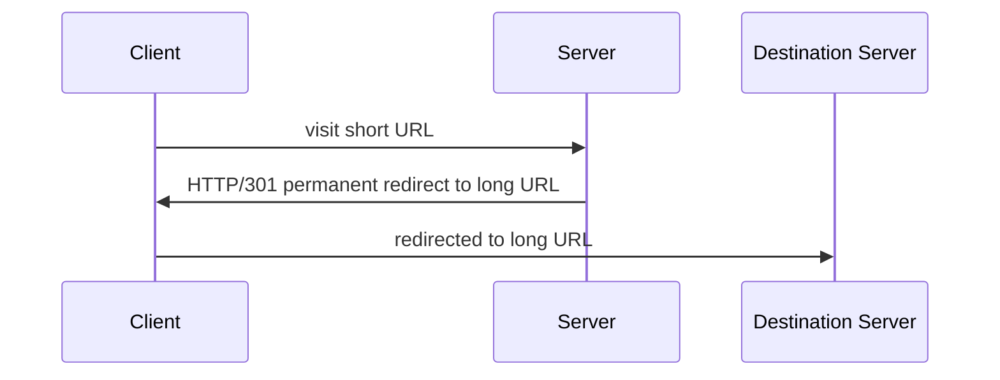
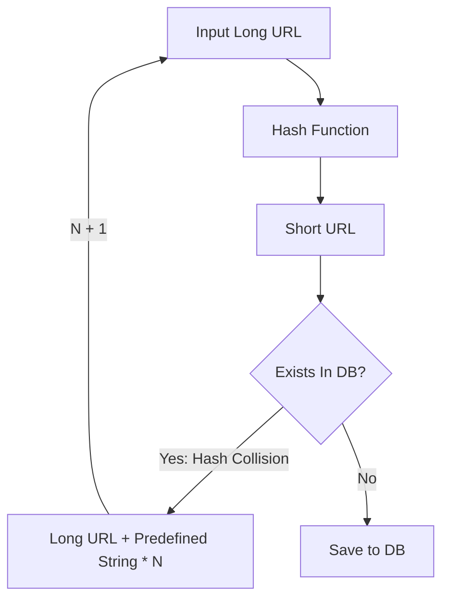
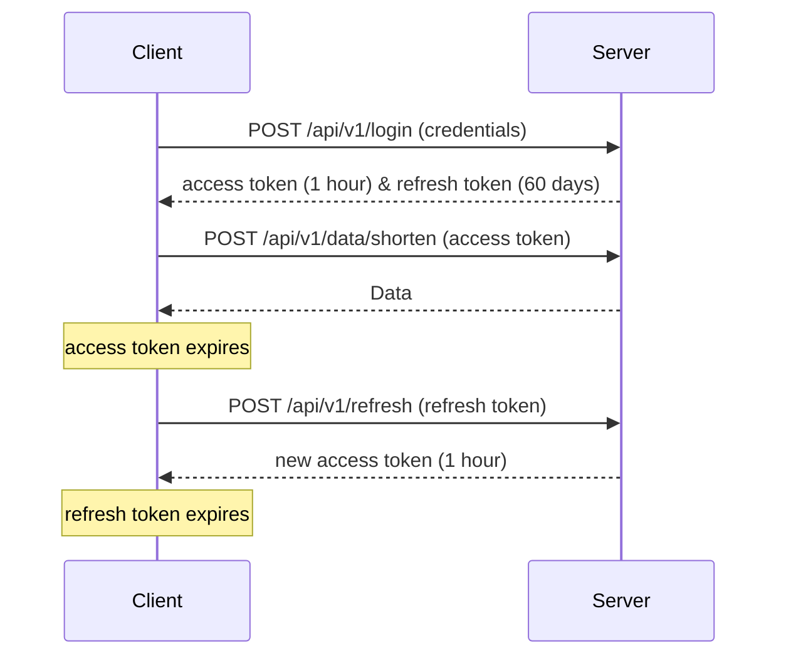

# URL Short
A simple URL shortening service, designed to convert longer URLs into concise, unique keys. 
This service provides the capability to use the unique key to access the original URL seamlessly.

## Key Features
- **URL Compression:** The service accepts a URL and generates a unique key representing the corresponding URL.
- **URL Redirection**: Clients are can accessing the original link via the unique key provided to them.
- **CRUD Operations**: Clients can create, read, update and delete their own links.

## High Level Design


## API Endpoints

### `GET /api/v1/healthz` 
Description: The health endpoint for the API used for health checks.

Response:
`200 OK`: The server is healthy and ready to respond to requests.


### `POST /api/v1/data/shorten` 
Description: Used to turn a long URL into a short URL.
Request:
```
{
    "long_url":"https://www.google.com/my/long/path"
}
```
Response:
```
{
    "short_url":"<short url hash>"
}
```
`201 Created`: The short URL to long URL mapping has been created in the database.

### `GET /api/v1/{shortUrl}`
Description: Redirects an unauthenticated client from the short URL to the long URL.

Parameters: 
- Path 
    - `shortUrl` a reference to a short URL in that is stored in the database. 
    

- `DELTE /api/v1/{shortUrl}` 
Description: An authenticated endpoint that will delete a short URL a user owns.

Parameters:
- Path
    - `shortUrl` a reference to a short URL that is stored in the database.
- Headers
    - `Authorization: Bearer <token>`

### `PUT /api/v1/{shortUrl}`
Description: Allows for the updating of a long URL based on a short URL
Parameters:
- Path 
    - `shortUrl` a reference to a short URL in the database
- Headers
    - `Authorization: Bearer <token>`

## Hash Functionality

Keeping the hash length short is important while allowing us to store a large number of unique short URLs. 
A hash length of 7 characters will give us 62^7 (approximately 3.5 trillion) unique short URLs. 
The hashing functionality can be found in `internal/shortener/` with a comprehensive test suite to ensure reliability. 
The hash we generate is derived from an MD5 hash of the input string.

### Hash Collision Detection

An essential aspect of our hashing mechanism is collision detection. The `hashCollisionDetection()` 
function recursively checks if the hash already exists in the database. 
If a collision is detected, a new hash is generated by appending a predefined string to the original 
long URL until a unique hash is created.


## Authentication Overview

Authentication is handled through the use of JSON Web Tokens (JWT).
Upon a valid login request to the `/api/v1/login` endpoint, the client receives:
- **Access Token**: Valid for 1 hour, used to access protected endpoints.
- **Refresh Token**: Valid for 60 days, used to obtain a new access token without requiring the user to log in again.

Clients use the access token to access endpoints that require authentication, such as 
`/api/v1/data/shorten`. When the access token expires, the client can obtain a new one from the 
`/api/v1/refresh` endpoint using the refresh token.

Finally, when the refresh token expires, the client must request a new set of tokens
(both access token and refresh token) by logging in again at the `/api/v1/login` endpoint.

The security considerations around the use of JWTs are:
- HTTPs should always be used as a transmission protocol between client and server
- Clients should look to securely store tokens for example using `HttpOnly` cookie (This would be communicated with the front end team).
- Access tokens have a short lifetime and refresh tokens can be revoked from the database. 
- The JWT signing secret my remain secure, I would look to store this in some secret storage platform such as 
Hashicorp Vault or AWS Secrets Manager.


