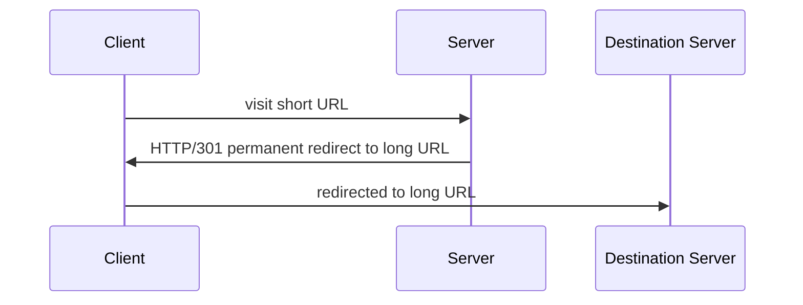

# URL Short
A simple URL shortening service, designed to convert longer URLs into concise, unique keys. This service provides the capability to use the unique key to access the original URL seamlessly.

## Key Features
URL Compression: The service accepts a URL and generates a unique key representing the corresponding URL.
URL Redirection: Clients are can accessing the original link via the unique key provided to them.
CRUD Operations: Clients can create, read, update and delete their own links.

## High Level Design

